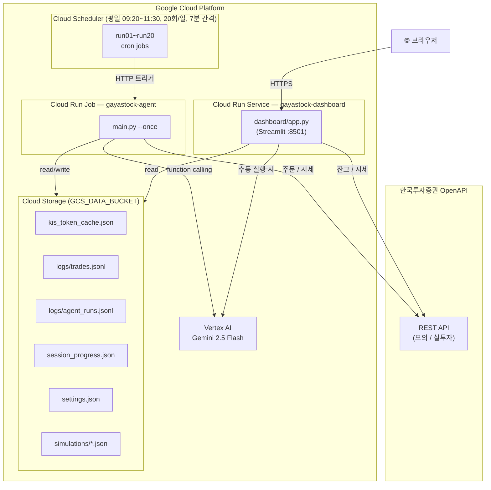
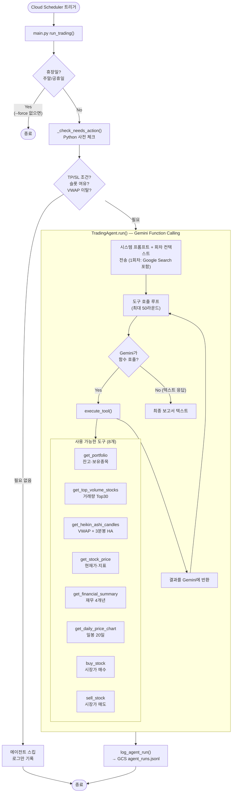
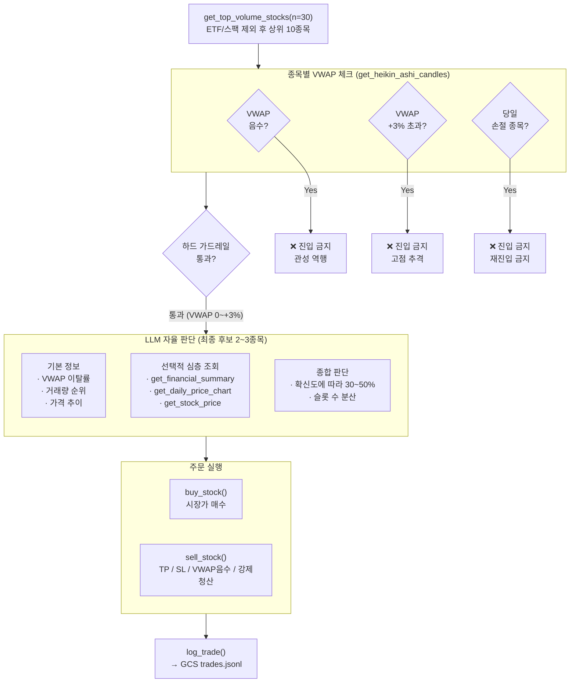
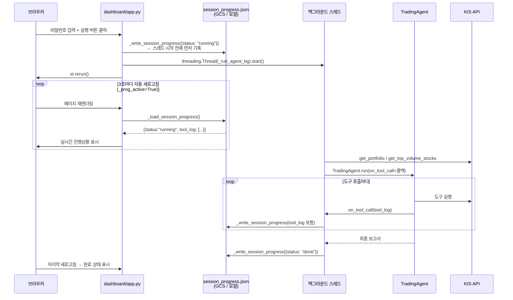
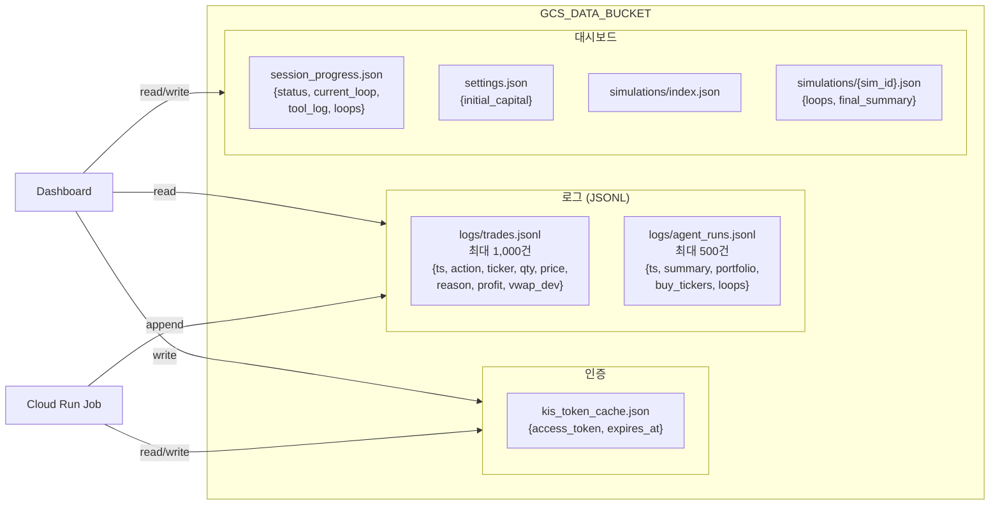
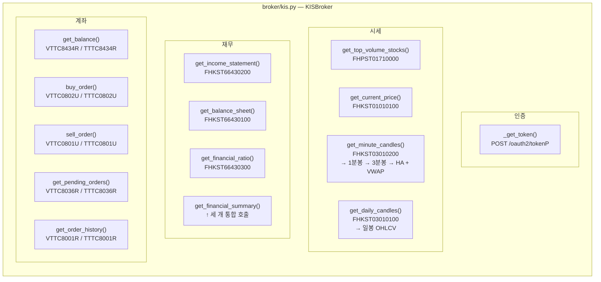
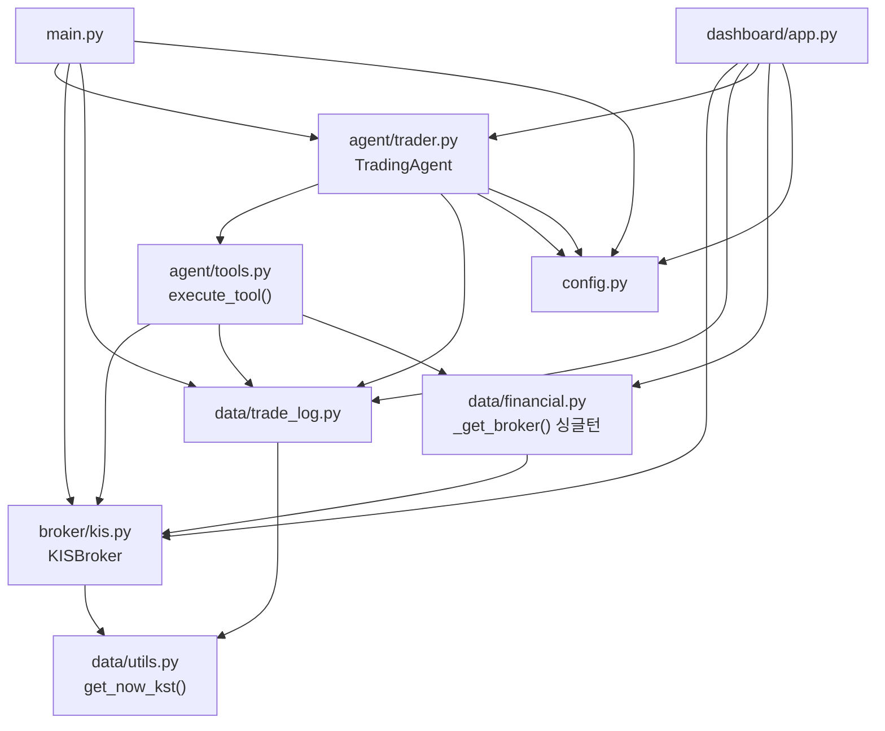
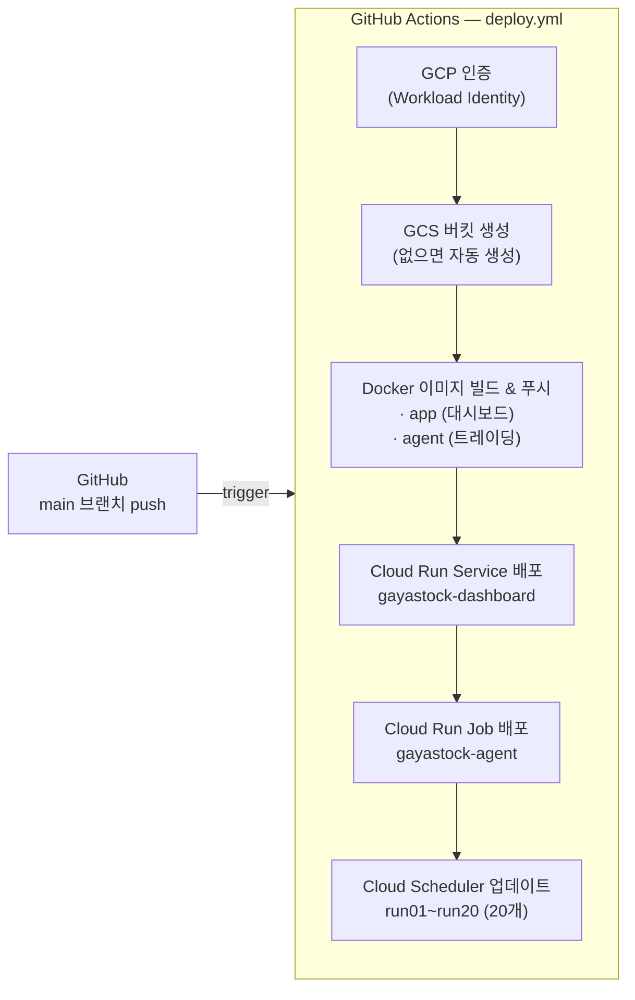

# gayastock 아키텍처 & 동작 플로우

> 최종 업데이트: 2026-05-23 · 전략 v5 기준

---

## 1. 시스템 전체 구조

---

## 2. 트레이딩 루프 플로우 (Cloud Run Job)

---

## 3. LLM 진입 판단 플로우 (전략 v5)

---

## 4. 회차별 행동 규칙

```mermaid
gantt
    title 당일 트레이딩 타임라인 (KST)
    dateFormat HH:mm
    axisFormat %H:%M

    section 진입
    1회차 — Google 검색 + 진입     : 09:20, 7m

    section 오전 점검 (2~8회차)
    2회차 — TP/SL + 추가 진입      : 09:27, 7m
    3회차 — TP/SL + 추가 진입      : 09:34, 7m
    4회차 — TP/SL + 추가 진입      : 09:41, 7m
    5회차 — TP/SL + 추가 진입      : 09:48, 7m
    6회차 — TP/SL + 추가 진입      : 09:55, 7m
    7회차 — TP/SL + 추가 진입      : 10:02, 7m
    8회차 — TP/SL + 추가 진입      : 10:09, 7m

    section 오전 후반 (9~15회차)
    9회차 — 기준 강화              : 10:16, 7m
    10회차 — 기준 강화             : 10:23, 7m
    11회차 — 기준 강화             : 10:30, 7m
    12회차 — 기준 강화             : 10:37, 7m
    13회차 — 기준 강화             : 10:44, 7m
    14회차 — 기준 강화             : 10:51, 7m
    15회차 — 기준 강화             : 10:58, 7m

    section 정리 (16~18회차)
    16회차 — 신규 진입 원칙 금지    : 11:05, 7m
    17회차 — 신규 진입 원칙 금지    : 11:12, 7m
    18회차 — 신규 진입 원칙 금지    : 11:19, 7m

    section 청산
    19회차 — 청산 준비             : 11:26, 4m
    20회차 — 강제 전량 청산        : 11:30, 1m
```

---

## 5. 대시보드 실행 플로우

---

## 6. GCS 데이터 구조

---

## 7. KIS API 호출 맵

---

## 8. 모듈 의존 관계

---

## 9. 환경변수 & 설정

| 변수 | 필수 | 기본값 | 설명 |
|------|:----:|--------|------|
| `GCP_PROJECT_ID` | ✅ | — | Vertex AI 프로젝트 ID |
| `GCP_REGION` | | `asia-northeast3` | Vertex AI 리전 |
| `GEMINI_MODEL` | | `gemini-2.5-flash` | LLM 모델 |
| `KIS_APP_KEY` | ✅ | — | KIS API 키 (Secret Manager) |
| `KIS_APP_SECRET` | ✅ | — | KIS API 시크릿 (Secret Manager) |
| `KIS_ACCOUNT_NO` | ✅ | — | 계좌번호 `XXXXXXXX-XX` |
| `KIS_MOCK` | | `true` | `true`=모의투자 / `false`=실계좌 |
| `DRY_RUN` | | `false` | `true`=주문 전송 안 함 |
| `GCS_DATA_BUCKET` | | — | 로그·토큰 저장 버킷 |
| `GCS_TOKEN_BUCKET` | | — | 토큰 전용 버킷 (없으면 DATA_BUCKET 공유) |
| `LOG_DIR` | | `logs` | 로컬 로그 디렉토리 |
| `MAX_POSITIONS` | | `5` | 최대 보유 종목 수 |
| `TAKE_PROFIT_PCT` | | `4.0` | 익절 기준 (%) |
| `STOP_LOSS_PCT` | | `2.5` | 손절 기준 (%) |
| `INNER_LOOP_COUNT` | | `1` | 루프 반복 횟수 |
| `INNER_LOOP_SLEEP_SEC` | | `90` | 루프 간 대기 (초) |
| `INITIAL_CAPITAL` | | `0` | 투자 원금 (대시보드 표시) |

---

## 10. 배포 파이프라인

---

## 11. 주요 설계 결정

| 항목 | 결정 | 이유 |
|------|------|------|
| LLM 진입 조건 | VWAP 가드레일 + LLM 자율 판단 | 기계적 HA 규칙 제거, 시장 맥락 반영 |
| HA 패턴 | 참고 데이터로만 제공 (진입 조건 아님) | 오신호 빈발, LLM이 더 유연하게 판단 |
| 포지션 사이징 | 가용예수금 최대 50% | 연속 손실 방지 |
| 당일 손절 재진입 | 금지 | 쏠리드/한국첨단소재 사례 재발 방지 |
| 강제 청산 | 11:30 전 전량 매도 | 당일 리스크 제거 |
| 토큰 캐시 | GCS 우선 → 로컬 fallback | Cloud Run 재시작마다 재발급 방지 |
| GCS 쓰기 | generation match + 재시도 5회 | 동시 실행 시 로그 유실 방지 |
| 진행상황 기록 | 스레드 시작 전 먼저 기록 | st.rerun() 레이스 컨디션 방지 |
| 심층 분석 도구 | 최종 후보 2~3종목에만 사용 | MAX_TOOL_ROUNDS=50 내 매매 라운드 확보 |
